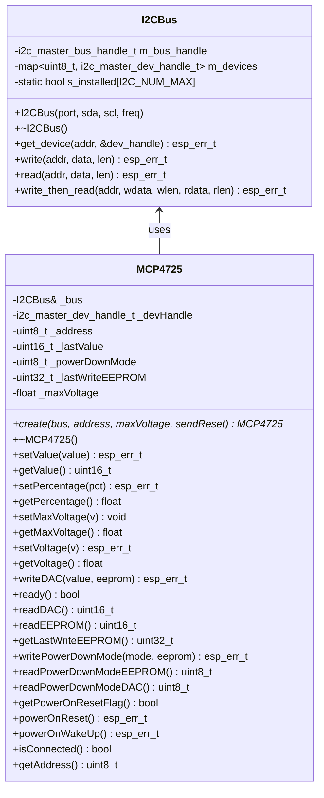

# MCP4725 12‑Bit DAC Driver – Documentation

**Version:** 0.5.0
**Target Platform:** ESP‑IDF 5.5 (ESP32)
**Based on:** Microchip MCP4725 Datasheet (DS22039D)
**Reference chat:** [ED_MCP4725 Driver Development Discussion](https://chat.deepseek.com/a/chat/s/dba80167-8a43-4daf-8d13-7e6c30d54880)

---

## 1. IC Characteristics (from Datasheet DS22039D)

| Parameter | Value | Condition / Notes |
| :--- | :--- | :--- |
| **Resolution** | 12 bits | 4096 distinct output levels |
| **Supply Voltage** | 2.7 V to 5.5 V | Single supply, also serves as DAC reference |
| **Output Type** | Buffered, rail‑to‑rail | Output swings from VSS to VDD |
| **INL Error** | ±2 LSB typical | End‑point method (code range 100–4000) |
| **DNL Error** | ±0.2 LSB typical | Guarantees monotonic output, no missing codes |
| **Offset Error** | 0.02% of FSR typical | Code = 000h |
| **Gain Error** | –0.1% of FSR typical | Code = FFFh (offset error not included) |
| **Settling Time** | 6 μs typical | 1/4 to 3/4 full‑scale transition |
| **Power‑Down Current** | 60 nA typical | Normal mode: 210 μA typical |
| **I2C Speed** | Up to 3.4 MHz | Standard, Fast, High‑Speed modes |
| **EEPROM Endurance** | 1 million cycles | Data retention: 200 years at +25°C |
| **EEPROM Write Time** | 25 ms (max) | RDY/BSY bit indicates completion |
| **Address Options** | 0x60 … 0x67 | A0 pin selects LSB of address |

### 1.2 Output Voltage Formula (Datasheet Eq. 5‑1)

\[
V_{OUT} = \frac{V_{REF} \times D_n}{4096}
\]

Where:
- \(V_{REF} = V_{DD}\) (supply voltage)
- \(D_n\) = 12‑bit DAC code (0 … 4095)

**Note:** The denominator is **4096**, not 4095. At code 4095 the output is \(V_{REF} \times \frac{4095}{4096}\), approximately \(V_{REF} - 1\ \text{LSB}\). This matches the chip’s actual transfer characteristic.

---

## 2. Architecture & Class Diagram



---

## 3. Detailed API Reference

### 3.1 `I2CBus` Helper Class

The `I2CBus` class (defined in `ED_i2c.h`) manages the I2C master bus and caches device handles. You must create one bus instance per physical I2C port before using any MCP4725 device.

**Constructor:**
```cpp
I2CBus(i2c_port_t port, gpio_num_t sda, gpio_num_t scl, uint32_t freq_hz);
```

| Parameter | Description |
| :--- | :--- |
| `port` | I2C port (`I2C_NUM_0` or `I2C_NUM_1`) |
| `sda` | GPIO pin for SDA |
| `scl` | GPIO pin for SCL |
| `freq_hz` | Bus clock frequency (e.g., 100000, 400000, 3400000) |

Only one `I2CBus` instance per port is allowed; subsequent attempts will reuse the existing bus.

---

### 3.2 `MCP4725` Class

#### 3.2.1 Factory Method

```cpp
static MCP4725* create(I2CBus& bus, uint8_t address, float maxVoltage = 3.3f, bool sendReset = true);
```

**Parameters:**
- `bus` – Reference to an initialised `I2CBus`.
- `address` – 7‑bit I2C address (0x60 … 0x67). The three least significant bits are: **A2, A1** (hard‑wired at factory, default 00) and **A0** (determined by the A0 pin logic level – see datasheet §7.2).
- `maxVoltage` – Reference voltage (VDD). Default 3.3 V.
- `sendReset` – If `true` (default), sends a **General Call Reset** command after initialisation. This is recommended when the VDD ramp rate is slower than 1 V/ms (datasheet §5.4.2) to ensure EEPROM data is loaded correctly.

**Returns:** Pointer to a new `MCP4725` instance, or `nullptr` on failure (invalid address, no device response).

---

#### 3.2.2 Basic Output Control

##### `setValue()` / `getValue()`
```cpp
esp_err_t setValue(uint16_t value);
uint16_t getValue() const;
```

- **Datasheet reference:** Fast mode write command (C2=0, C1=0, C0=X) – updates DAC register only (datasheet §6.1.1, Figure 6‑1).
- `value` must be between 0 and 4095. The cached `_lastValue` is updated only after a successful I2C write.
- Returns `ESP_OK` on success, `ESP_ERR_INVALID_ARG` if out of range.

##### `setPercentage()` / `getPercentage()`
```cpp
esp_err_t setPercentage(float percentage);
float getPercentage() const;
```

- Converts percentage (0…100) to a 12‑bit value: `value = round(percentage * 0.01 * 4095)`.
- No direct datasheet equivalent; a convenience wrapper around `setValue()`.

##### `setVoltage()` / `getVoltage()`
```cpp
esp_err_t setVoltage(float v);
float getVoltage() const;
```

- **Datasheet formula:** \(V_{OUT} = \frac{V_{REF} \times D_n}{4096}\) (Equation 5‑1).
- `setVoltage()` computes the required code using `v * 4096 / maxVoltage` and clamps to 4095.
- `getVoltage()` returns the theoretical voltage based on the cached last value.
- The maximum output at code 4095 is `maxVoltage * 4095/4096`, not the full `maxVoltage`.

##### `setMaxVoltage()` / `getMaxVoltage()`
```cpp
void setMaxVoltage(float v);
float getMaxVoltage() const;
```

- Sets or returns the reference voltage used for voltage scaling. Does not affect the hardware.

---

#### 3.2.3 EEPROM and Advanced Features

##### `writeDAC()` – Write to DAC Register (optional EEPROM)
```cpp
esp_err_t writeDAC(uint16_t value, bool eeprom = false);
```

- **Datasheet reference:**
  - If `eeprom = false`: command type `010` (Write DAC Register) – updates DAC register only (datasheet §6.1.2, Figure 6‑2).
  - If `eeprom = true`: command type `011` (Write DAC Register and EEPROM) – updates both DAC register and non‑volatile memory (datasheet §6.1.3, Figure 6‑2).
- Before writing, this method waits for any ongoing EEPROM write to finish by polling the `ready()` status.
- On an EEPROM write, the internal charge pump is enabled, the RDY/BSY bit goes low, and the device ignores further writes until the operation completes (max 25 ms, datasheet §5.6).

##### `ready()`
```cpp
bool ready();
```

- Reads the first status byte (datasheet Table 5‑4, Figure 6‑3).
- Returns `true` if bit 7 (RDY/BSY) is 1, indicating the EEPROM is ready for a new write or read.
- Should be polled after every `writeDAC(..., true)` before issuing new commands.

##### `readDAC()`
```cpp
uint16_t readDAC();
```

- Performs a read of the DAC register (3‑byte read, datasheet Figure 6‑3).
- The returned value is the current DAC input code (12 bits).
- Waits for `ready()` to be `true` (EEPROM not busy) because an ongoing EEPROM write can block the read.

##### `readEEPROM()`
```cpp
uint16_t readEEPROM();
```

- Performs a 5‑byte read to obtain the DAC code stored in EEPROM (datasheet Figure 6‑3).
- Returns the 12‑bit value previously saved with `writeDAC(..., true)`.
- Also waits for `ready()`.

##### `getLastWriteEEPROM()`
```cpp
uint32_t getLastWriteEEPROM() const;
```

- Returns the timestamp (in milliseconds) of the last successful EEPROM write, obtained from `esp_timer_get_time()`. Useful for debugging or logging.

##### `writePowerDownMode()` – Set Power‑Down Mode
```cpp
esp_err_t writePowerDownMode(uint8_t mode, bool eeprom = false);
```

- **Datasheet reference:** Table 5‑2.
  - `mode = 0` → Normal operation
  - `mode = 1` → 1 kΩ load to GND
  - `mode = 2` → 100 kΩ load to GND
  - `mode = 3` → 500 kΩ load to GND
- In power‑down, the output amplifier is disabled and the output pin is connected to the selected resistor. The I2C interface remains active.
- If `eeprom = true`, the power‑down setting is also saved to non‑volatile memory and will be restored after a power cycle.

##### `readPowerDownModeDAC()`
```cpp
uint8_t readPowerDownModeDAC();
```

- Reads the power‑down mode from the **DAC register** (first status byte, bits 5‑4, datasheet Figure 6‑3).
- Returns 0…3.

##### `readPowerDownModeEEPROM()`
```cpp
uint8_t readPowerDownModeEEPROM();
```

- Reads the power‑down mode from the **EEPROM** (4‑byte read, byte 3 bits 5‑4).
- Returns the stored mode (0…3).

##### `getPowerOnResetFlag()`
```cpp
bool getPowerOnResetFlag();
```

- Reads the POR flag (bit 6 of the first status byte, datasheet Table 5‑4).
- Returns `true` if a power‑on reset has occurred since the last read. The flag is cleared after reading.
- Useful to detect unexpected power glitches.

##### `powerOnReset()` – General Call Reset
```cpp
esp_err_t powerOnReset();
```

- Sends a **General Call Reset** command (second byte = 0x06) to address 0x00 (datasheet §7.3.1).
- Causes the device to abort current conversion, perform an internal reset (like POR), and reload the DAC register from EEPROM.
- After this call, `getValue()` is updated by reading the DAC register.

##### `powerOnWakeUp()` – General Call Wake‑Up
```cpp
esp_err_t powerOnWakeUp();
```

- Sends a **General Call Wake‑Up** command (second byte = 0x09) to address 0x00 (datasheet §7.3.2).
- Resets the power‑down bits in the DAC register to normal operation (0,0). The EEPROM power‑down setting is unchanged.
- Use this to exit power‑down mode without writing a new value.

##### `isConnected()`
```cpp
bool isConnected();
```

- Probes the device by attempting to read 1 byte.
- Returns `true` if the device acknowledges its I2C address.

##### `getAddress()`
```cpp
uint8_t getAddress() const;
```

- Returns the 7‑bit I2C address used for this instance.

---

## 4. Usage Examples

### 4.1 Basic Initialisation

```cpp
#include "ED_i2c.h"
#include "ED_MCP4725.h"

extern "C" void app_main() {
    // Create I2C bus on port 0, pins 21(SDA) and 22(SCL), 400 kHz
    I2CBus i2c_bus(I2C_NUM_0, GPIO_NUM_21, GPIO_NUM_22, 400000);

    // Create MCP4725 at address 0x60, Vref = 3.3 V, auto‑reset enabled
    auto dac = ED_MCP4725::MCP4725::create(i2c_bus, 0x60, 3.3f, true);
    if (dac == nullptr) {
        ESP_LOGE("main", "Failed to initialise MCP4725");
        return;
    }

    // Set output to 1.8 V
    dac->setVoltage(1.8f);
    ESP_LOGI("main", "Output = %.3f V", dac->getVoltage());

    // Clean up (optional – bus will outlive the dac)
    delete dac;
}
```

### 4.2 Ramping with Maximum Resolution (1 LSB steps)

```cpp
void ramp_demo(ED_MCP4725::MCP4725& dac) {
    float vref = dac.getMaxVoltage();
    float lsb = vref / 4096.0f;   // 1 LSB voltage

    for (uint16_t code = 0; code <= 4095; code++) {
        dac.setValue(code);
        printf("Code %4u = %.6f V\n", code, dac.getVoltage());
        vTaskDelay(pdMS_TO_TICKS(1));   // wait 1 ms between steps
    }
}
```

### 4.3 Writing to EEPROM and Verifying

```cpp
void eeprom_test(ED_MCP4725::MCP4725& dac) {
    const uint16_t test_value = 2048;

    // Write to DAC + EEPROM
    dac.writeDAC(test_value, true);

    // Wait for EEPROM write to complete
    while (!dac.ready()) {
        vTaskDelay(pdMS_TO_TICKS(1));
    }

    // Read back from EEPROM
    uint16_t stored = dac.readEEPROM();
    ESP_LOGI("test", "Stored = %u, expected = %u", stored, test_value);
}
```

### 4.4 Using Power‑Down Mode

```cpp
void power_down_demo(ED_MCP4725::MCP4725& dac) {
    // Enter 100kΩ pull‑down mode (saves power)
    dac.writePowerDownMode(MCP4725_PDMODE_100K, false);

    // Read back the current mode from DAC register
    uint8_t mode = dac.readPowerDownModeDAC();
    ESP_LOGI("test", "Power‑down mode = %d", mode);

    // Wake up (return to normal operation)
    dac.powerOnWakeUp();
}
```

### 4.5 Detecting Power‑On Reset

```cpp
void check_por(ED_MCP4725::MCP4725& dac) {
    if (dac.getPowerOnResetFlag()) {
        ESP_LOGW("test", "Power‑on reset detected! Re‑initialising...");
        // Re‑send configuration if needed
        dac.setVoltage(1.5f);
    }
}
```

### 4.6 Calibration Example (Compensating 5 mV Offset)

```cpp
// Compensate a constant 5 mV offset at the DAC output
float compensate_offset(ED_MCP4725::MCP4725& dac, float target_voltage) {
    const float offset = 0.005f;   // measured offset
    float corrected = target_voltage + offset;
    if (corrected > dac.getMaxVoltage()) corrected = dac.getMaxVoltage();
    if (corrected < 0) corrected = 0;
    return corrected;
}

// Usage
float desired = 1.0f;
dac.setVoltage(compensate_offset(dac, desired));
```

---

## 5. Error Handling

All functions that perform I2C communication return `esp_err_t`. Common return codes:

| Code | Meaning |
| :--- | :--- |
| `ESP_OK` | Success |
| `ESP_ERR_INVALID_ARG` | Value out of range (e.g., voltage > Vref, code > 4095) |
| `ESP_ERR_NOT_FOUND` | Device not responding (isConnected = false) |
| `ESP_ERR_TIMEOUT` | I2C transaction timeout (rare, usually bus issue) |

For debugging, use `ESP_ERROR_CHECK(dac->setValue(...))` to halt on failure.

---

*End of Documentation*
```